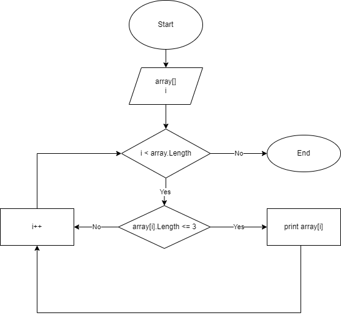

# Описание.
1. На входе задаем массив элементов фиксированный длины.
2. Выводим элементы массива с помощью цикла, до тех пор пока пока индекс (i) меньше длины массива
3. Выполняем проверку условия: длина элемента меньше либо равна 3.
4. Выводим удовлетворяющие условию элементы.

____________________________

